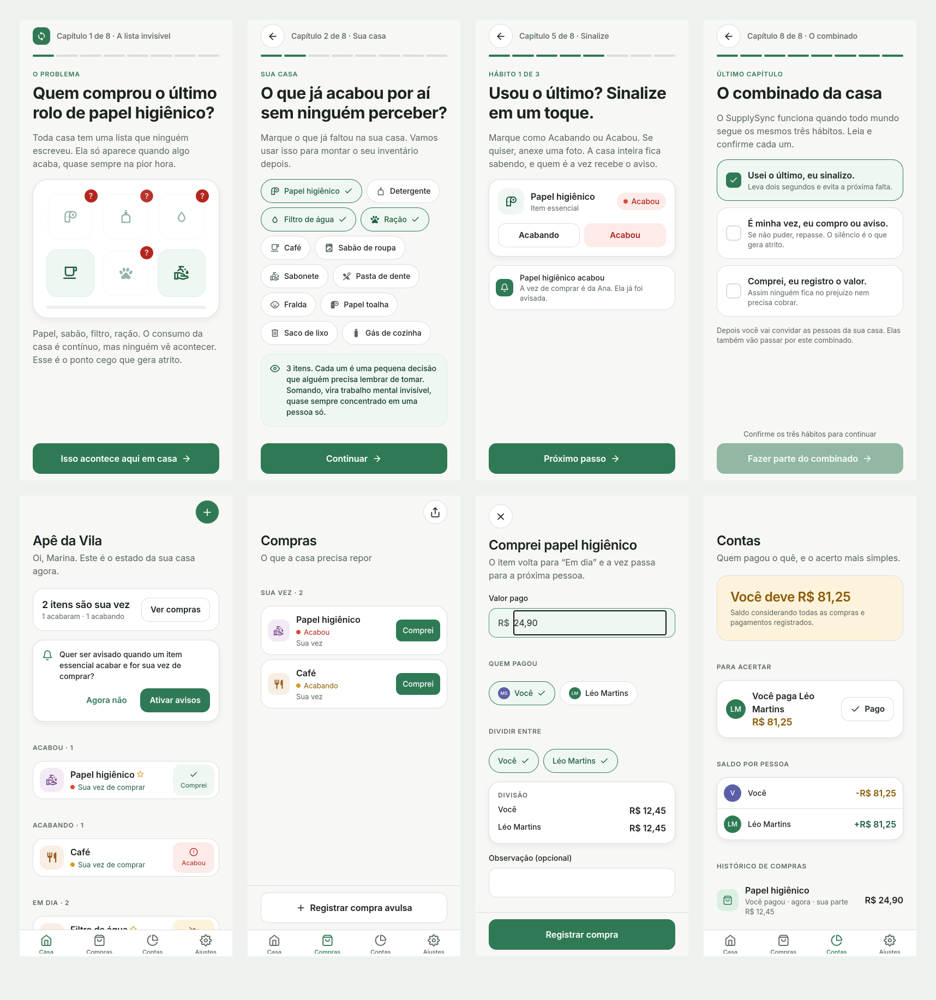

# SupplySync

Inventário compartilhado da casa, reposição inteligente e divisão de custos quase automática.
Para casais, famílias e grupos de 3 a 6 moradores que perdem tempo (e paciência) com
"quem comprou o último papel higiênico?".



## O que o MVP entrega

- **Onboarding narrativo em 8 capítulos**: mostra o problema, deixa a pessoa experimentar cada mecânica e termina com o "combinado da casa". Sem botão de pular; capítulos interativos só avançam após a interação. As respostas viram o inventário inicial.
- **Inventário compartilhado** com estados Em dia, Acabando e Acabou, sinalizados em um toque, com foto e observação opcionais.
- **De quem é a vez**: rodízio, preferência ou equilíbrio (quem gastou menos).
- **Avisos push** quando um item essencial acaba: quem está na vez recebe "é a sua vez"; o resto da casa sabe quem vai comprar.
- **Lista de compras automática**, separada entre "sua vez" e "outras pessoas", com estimativa de valor e compartilhamento em texto (WhatsApp, notas etc.).
- **Divisão de custos**: registrar compra, dividir entre quem participa, saldo por pessoa e sugestão do menor número de pagamentos.
- **Freemium** aplicado no servidor: 1 casa, 4 moradores, 20 itens e 60 dias de histórico no plano gratuito.
- **Segurança desde o início**: veja [docs/SECURITY.md](docs/SECURITY.md).

## Stack

App **Expo SDK 57 / React Native** (expo-router, TanStack Query, Reanimated) · API **Fastify 5 / Node 22** ·
**PostgreSQL + Prisma** · **Zod** compartilhado · monorepo npm workspaces.
Detalhes em [docs/ARCHITECTURE.md](docs/ARCHITECTURE.md).

## Rodando localmente

Pré-requisitos: Node 22+, Docker (ou PostgreSQL 16 local) e o app Expo Go ou um emulador.

```bash
npm install

# Banco e Redis de desenvolvimento
docker compose up -d

# API
cp apps/api/.env.example apps/api/.env
# preencha JWT_ACCESS_SECRET, TOKEN_HASH_SECRET e PASSWORD_PEPPER com valores gerados por:
node -e "console.log(require('crypto').randomBytes(48).toString('base64url'))"
npm run db:migrate            # cria as tabelas
npm run dev:api               # http://127.0.0.1:3333

# App (em outro terminal)
cp apps/mobile/.env.example apps/mobile/.env
# em aparelho físico, use o IP da sua máquina em EXPO_PUBLIC_API_URL e HOST=0.0.0.0 na API
npm run dev:mobile
```

Em desenvolvimento os e-mails não são enviados: o código de confirmação aparece no log da API.

## Qualidade

```bash
npm run typecheck             # shared, api e mobile
npm test                      # 15 testes de domínio + 21 testes de integração da API
```

Os testes de integração usam um PostgreSQL real. Defina `TEST_DATABASE_URL` apontando para um banco descartável
(os testes apagam os dados dele).

## Publicação

Passo a passo para produção, Cloudflare (WAF), Google Play e App Store em [docs/DEPLOY.md](docs/DEPLOY.md).
